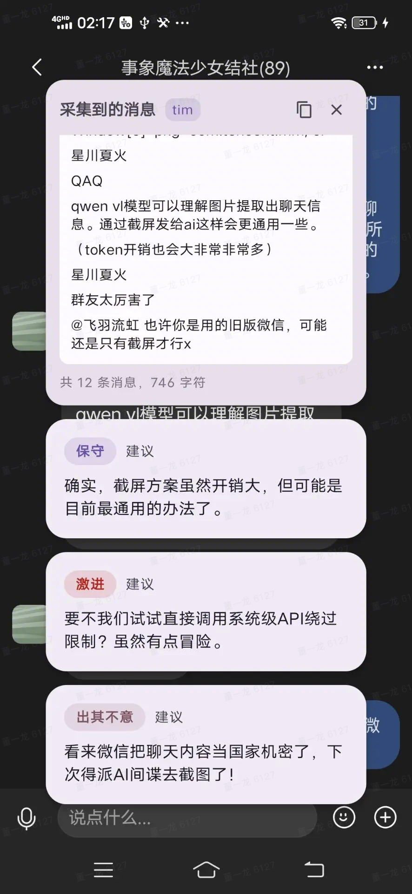
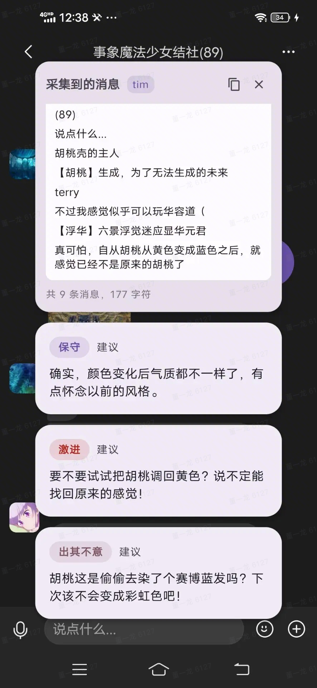
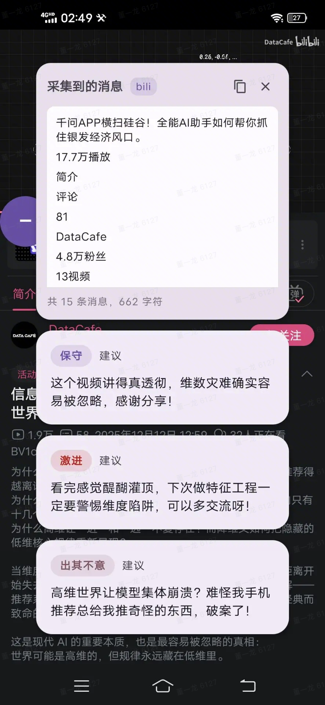
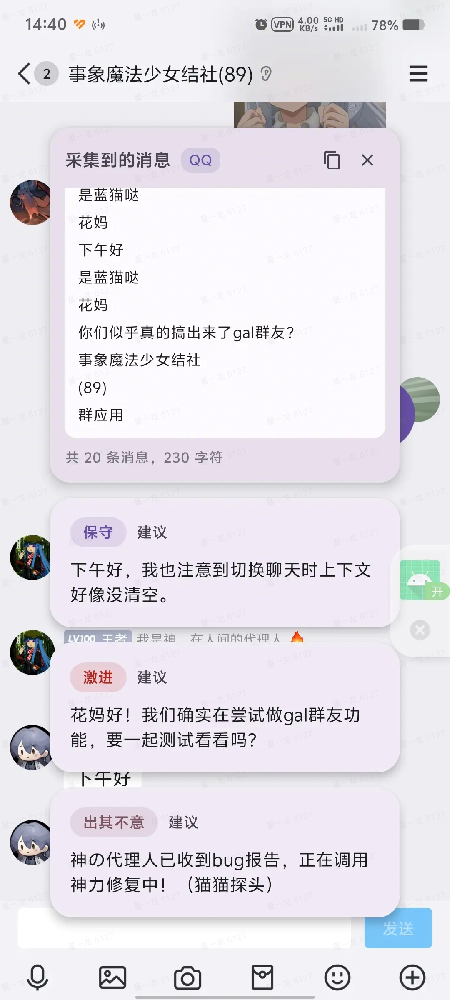

# Ratatoskr

一个“拉塔托斯克式”聊天辅助 App：在即时聊天中，通过无障碍采集上下文，点击悬浮球触发 AI 生成多条候选回复，用户点击自动复制到剪贴板。

## 愿景与灵感
- 灵感来源：《约会大作战》中拉塔托斯克为士道实时推送“三选一”应对方案。
- 愿景目标：为自闭谱系/社恐等需要社交辅助的用户，提供低成本、高质量的回复建议，降低沟通压力，提升沟通掌控感与关系推进的安全性。
它可以让你的聊天更聪明。Ratatoskr 在任何应用之上提供轻量悬浮面板，采集上下文并生成三类高质量建议（保守 / 激进 / 出其不意），一键复制、快速响应，显著提升对话效率与质量。

## 核心优势
- 即时建议：悬浮球一键生成，面板直接呈现三类策略化回复，场景覆盖广、落地直观。
- 轻量无侵入：不改动原 App 页面，系统级悬浮，随点随用，适合任何聊天/社交场景。
- 可配置后端：只要兼容 OpenAI，模型与 Base URL 都可以在设置页灵活配置。

## 主要功能
- 悬浮球与面板：
  - 点击悬浮球 → 生成三类建议。
  - 面板选中即复制
图片如下：

## 成为开发者？
- 构建与安装：
  - `export JAVA_HOME=$(/usr/libexec/java_home -v 17)`
  - `./gradlew assembleDebug`
  - `adb install -r app/build/outputs/apk/debug/app-debug.apk`
- 首次运行：
  - 在设置页填入你的模型与密钥（例如 `https://api.deepseek.com` + `deepseek-chat`）。
  - 开启悬浮窗权限，点击悬浮球体验建议生成。
- 日志定位：
  - 仅看本进程：`adb logcat --pid $(adb shell pidof com.neon10.ratatoskr) -v time`

欢迎体验与反馈，愿 Ratatoskr 成为你的“对话战术支援”。

